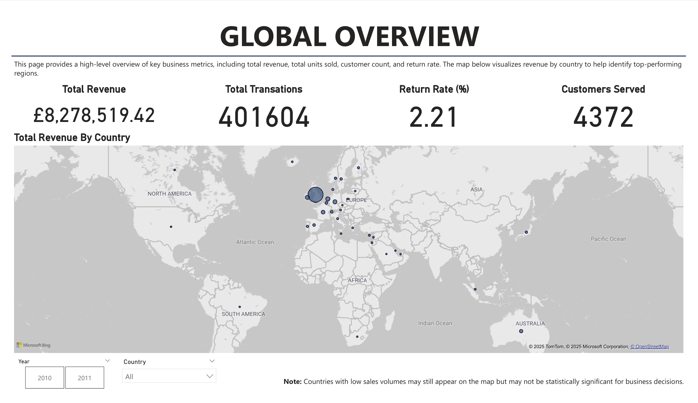
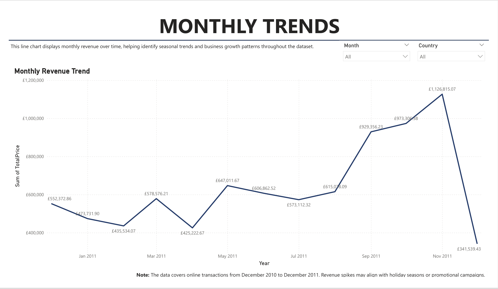
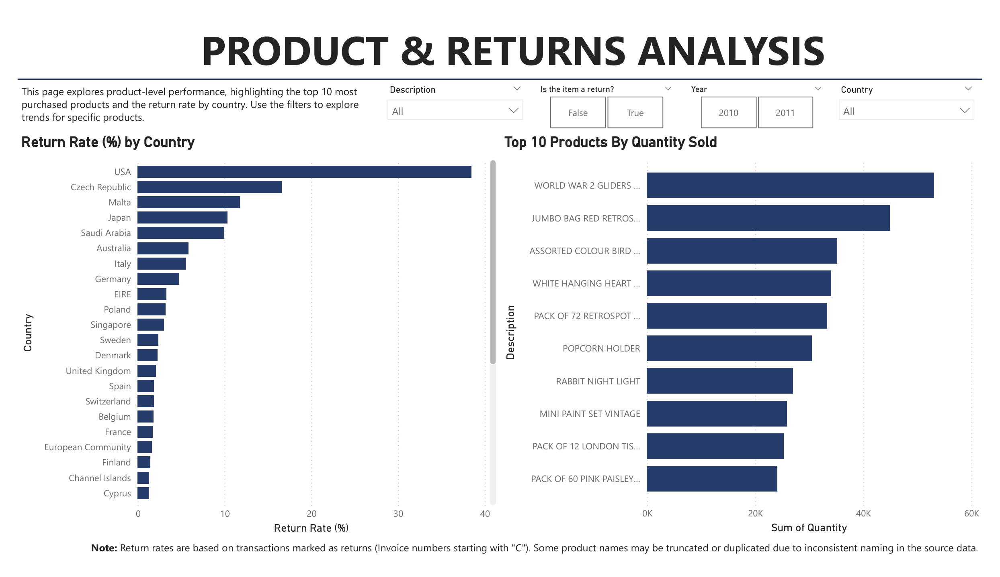

# Online Retail Return & Revenue Analysis
A full-stack analytics project using SQL, Python, and Power BI to extract insights from a UK-based e-commerce dataset. The project focused on return rates, revenue trends, and product performance across international customers.

---

## Project Goals
- Understand return behaviour and how it varies by country and product
- Visualise monthly revenue and purchasing trends
- Develop a scalable dashboard for non-technical stakeholders
- Practice end-to-end data workflow: cleaning, SQL querying, BI visualisation, and storytelling

---

## Business Impact
Demonstrated how structured analytics could highlight inefficiencies in customer returns, informing policy decisions like optimising warehouse restocking and prioritising high-value repeat customers.

---

## Dataset Overview
- **Source**: Online Retail dataset from Kaggle ([Link](https://www.kaggle.com/datasets/vijayuv/onlineretail/data))
- **Time Period**: December 2010 to December 2011
- **Size**: ~ 540,000 transactions; ~ 400,000 used after cleaning and validation
- **Columns**: InvoiceNo, StockCode, Description, Quantity, InvoiceDate, UnitPrice, CustomerID, Country
  
---

## Tools & Skills Used
| Tool | Use |
|----|-----|
| Python (Pandas)| Data cleaning, feature engineering |
| MySQL | Database creation, querying |
| Power BI | Dashboard design & visualisation |
| Git & Github | Version control & portfolio sharing |

---

## Final Dashboard (Preview)
_Visuals extracted from Power BI dashboard (click to enlarge)_





---

## Key Insights
- The overall return rate was **2.21%**, with **USA, Czech Republic and Malta** contributing the most returns.
- Total revenue was **£8.28 million**, with peak sales in **November 2011**.
- The most frequently puchased item was **World War 2 Gliders ASSTD Designs**.
- Returns were **not concentrated in a small number of products**. Instead, return volume was **more evenly distributed**, with the top 50 returned products accounting for only ~24% of the total returns. 
---

## Folder Structure

```bash
├─ data/
   └─ CleanedOnlineRetail.xlsx
├─ notebook/
   └─ 01_data_cleaning.ipynb
├─ sql/
   ├─ database_setup.sql
   └─ Retail_Insights_Part1.sql 
├─ visuals/
   ├─ overview-dashboard.png
   ├─ monthly-revenue-trends.png
   └─ product-and-return-analysis.png

```

---

## Next Steps
- Add customer segmentation (RFM or k-means)
- Implement a return probability model
- Expand to real-world e-commerce datasets for further validation

---

## Contact
If you'd like to collaborate, or have feedback, feel free to reach out via email at mariafernanda993@gmail.com.


---

  
